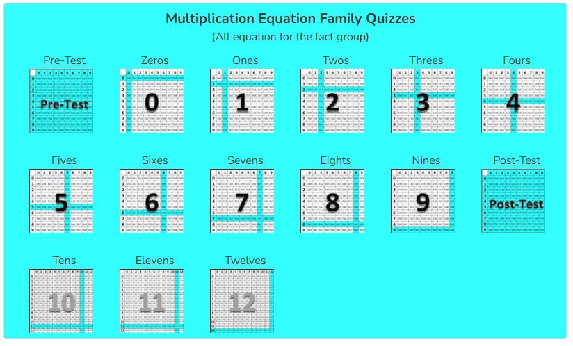
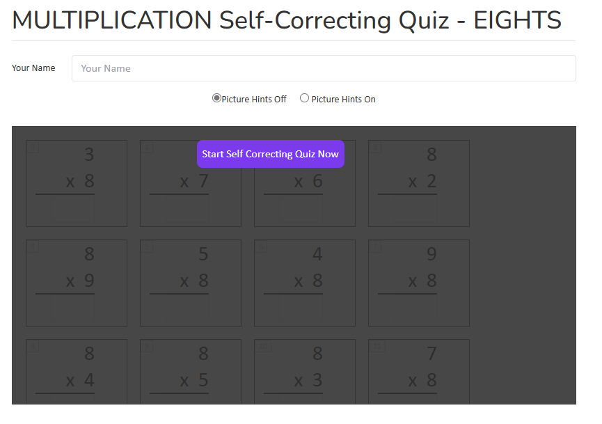
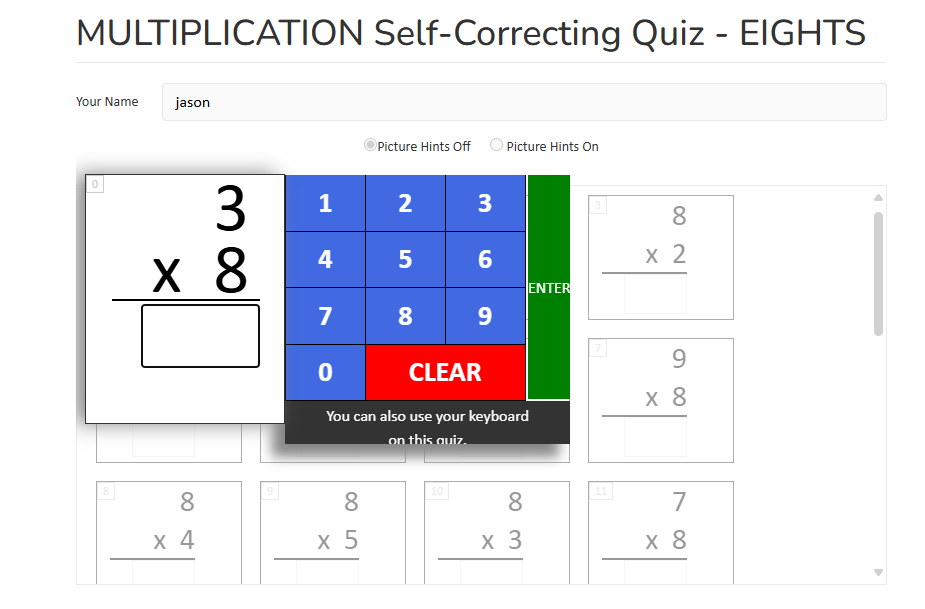

create a website for me

only frontend. 
tech: moden js and framework
site should be responsive and mobile friendly

1. molden headers with menu
2. let's build quizzes page first
3. that page include entrance to different quizzes like addition, subtraction, multiplication, division, etc.
4. let's do multiplication first. 
5. multiplication page should like this image

6. check each of the number, will show screen like this

7. type the name, click the button, will show screen like below, and randome question genareted for each of the number

8. type the answer, click the button, will switch to next question, untill all questions are answered (let's say 20 questions)
9. after all questions are answered, will show the final results of the quiz
